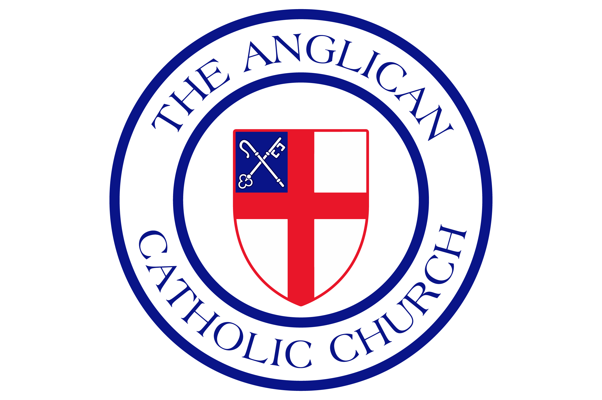

# Oración Común en Línea — DailyOfficeACC

**El Oficio Diario del Libro de Oración Común de 1928 en español**  
Presentado por la Iglesia Anglicana Católica



## Descripción

Aplicación web litúrgica que presenta el Oficio Diario completo según el Libro de Oración Común de 1928 (LOC 1928) en español. Inspirada en [commonprayeronline.com](https://commonprayeronline.com/), con autorización de su creador.

### Características

- **Oración Matutina y Vespertina** — Texto completo con salmos y lecturas del día
- **Leccionario automático** — Salmos y lecciones calculados según la tabla del LOC 1928
- **Kalendario litúrgico** — Calendario visual con colores del Ordo (rojo, blanco, morado, verde)
- **Salterio completo** — 150 Salmos con ciclo de 30 días
- **Santa Comunión** — Orden completo con Propios del Día (Colectas, Epístolas, Evangelios)
- **La Letanía** — Texto íntegro de la Plegaria General
- **Oraciones y Acciones de Gracias** — Colección de oraciones para diversas ocasiones
- **Oficios Horarios** — Mediodía y Completas
- **Oración Familiar** — Para uso en el hogar
- **Modo oscuro** — Tema cálido para lectura nocturna
- **Responsive** — Diseño adaptable a móvil y escritorio

## Tecnología

| Stack | Versión |
|-------|---------|
| Next.js | 16.3 |
| React | 19.2 |
| TypeScript | 5.x |
| Tailwind CSS | 4.x |

## Instalación

```bash
cd DailyOfficeACC
pnpm install
pnpm dev
```

La aplicación se abre en `http://localhost:3000`.

## Estructura

```
app/src/
├── app/                        # Páginas (App Router)
│   ├── oficio/                 # Oración Matutina y Vespertina
│   ├── santa-comunion/         # Santa Comunión
│   ├── salterio/               # El Salterio (150 Salmos)
│   ├── kalendario/             # Calendario litúrgico
│   ├── letania/                # La Letanía
│   ├── oraciones/              # Oraciones y Acciones de Gracias
│   ├── familia/                # Oración Familiar
│   └── oficios-horarios/       # Mediodía y Completas
├── components/                 # Componentes reutilizables
├── data/                       # Datos litúrgicos (salmos, colectas, fiestas)
└── lib/                        # Lógica (calendario eclesiástico, leccionario)
```

## Fuentes

- **LOC 1928** — Libro de Oración Común de 1928, traducción al español
- **Ordo Kalendar 2026** — Calendario litúrgico de la Iglesia Anglicana Católica
- **Biblia** — Texto bíblico de referencia: [conferenciaepiscopal.es/biblia](https://www.conferenciaepiscopal.es/biblia/)

## Licencia

MIT — Ver [LICENSE](LICENSE)

## Contribuir

Ver [CONTRIBUTING.md](CONTRIBUTING.md)

---

*Ad maiorem Dei gloriam*
